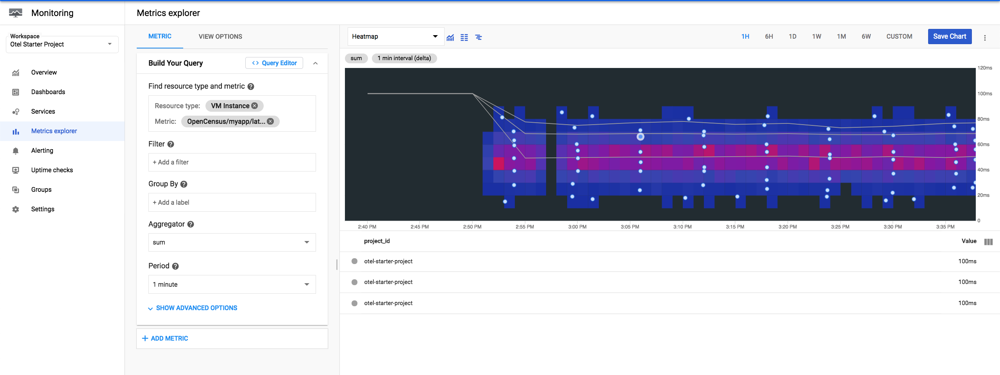

# Java OpenCensus GRPC Example 

Running this collects OpenCensus GRPC instrumentation stats and traces.
However, grpc-census doesn't send exemplars. I added a custom metric which
measures the latency and attaches exemplars for demo.





## Run
```bash
$ ./gradlew installDist
$ GCP_PROJECT_ID="<project string>" ./build/install/GrpcTest/bin/hello-server

# In another terminal, run requests against it
$ for i in {1..10000}; do grpc_cli_local call localhost:50051 SayHello "message: 'gRPC CLI'" ; done
```

